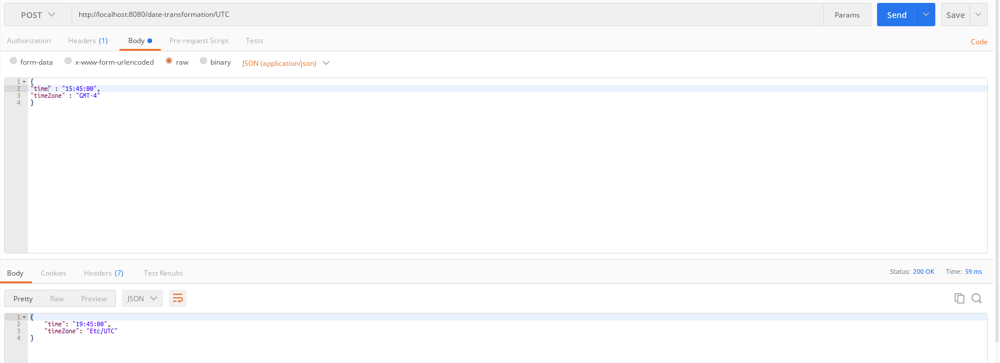
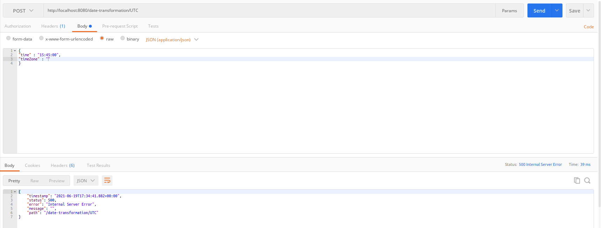

# date transformacion service

REST API for date transformacion

## Tópicos
*  **[📝 Requerimientos / tecnologias](#-requerimientos)**
*  **[🚀 Solucion](#-Solucion)**
*  **[🗂 Estructura de Directorios](#-estructura-de-directorios)**

## 📝 Requerimientos / Tecnologias
```
Java 11
Spring boot 2.5.0
lombok
```
## 🚀 Solucion

El proyecto se compone de un servicio rest POST que al ser invocado se le envia una hora con una zona horaria, 
y el mismo devuelve la hora UTC.

## 🗂 Estructura de Directorios
```
📦 resume-api 
│
│  
└─📁 src                  Código fuente
│ │
│ └─📁 java               Módulos raíces para el software
│ │
│ └─📁 test               Pruebas funcionales del software
│
└─📄 README.md            Documentacion del software

```
## 👓 Pruebas
* Caso de exito

* Caso fallido
